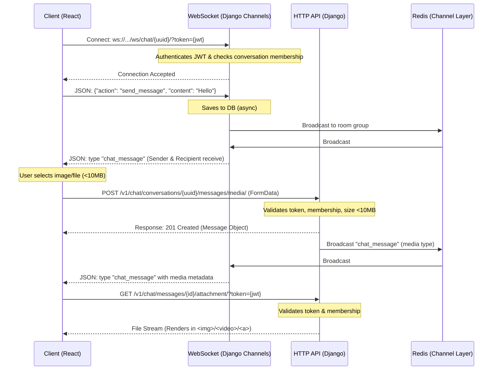

# Frontend Integration Guide: Real-Time Chat & Media Sharing

This guide details the step-by-step implementation for integrating the backend Django Channels WebSocket and HTTP REST APIs into the React/TypeScript frontend.

---

## 1. Architectural Overview

The communication system uses a hybrid approach to ensure speed, security, and stability:
1. **WebSockets (Django Channels)**: Used for real-time text message exchanges, unread notifications, and message delivery/read status updates.
2. **HTTP REST API**: Used for heavy operations like fetching historical messages, listing conversations (ordered by recent activity), initiating conversations with optional product inquiries, uploading media (up to 10 MB), and securely streaming downloads.



---

## 2. API Reference

### 2.1 HTTP REST Endpoints

All HTTP requests must include the JWT token in the headers:
`Authorization: Bearer <access_token>`

#### 1. Create or Retrieve Conversation (With Daraz-style Product Context)
* **Endpoint**: `POST /v1/chat/conversations/`
* **Description**: Initiates or retrieves the single direct conversation room between the buyer and the seller. If a `product_id` is supplied, it automatically inserts a reference message (of type `product_link`) indicating that the buyer is interested in this specific product.
* **Payload (Buyer)**: 
  ```json
  {
    "seller_id": 5,
    "product_id": 14  // Optional
  }
  ```
* **Payload (Seller)**: 
  ```json
  {
    "buyer_id": 12,
    "product_id": 14  // Optional
  }
  ```
* **Response (200 OK / 201 Created)**:
  ```json
  {
    "id": "e2a0b1df-4b9e-41d1-9311-66778899aabb",
    "buyer": { "id": 12, "name": "Buyer Name", "phone": "+8801700000012" },
    "seller": { "id": 5, "name": "Seller Name", "phone": "+8801700000005" },
    "created_at": "2026-08-27T06:00:00Z"
  }
  ```

#### 2. Get Recent Chats List (History-wise)
* **Endpoint**: `GET /v1/chat/conversations/`
* **Description**: Returns all conversations the requesting user is a part of, automatically ordered by the timestamp of the most recent message (most active chats first).
* **Response (200 OK)**:
  ```json
  [
    {
      "id": "e2a0b1df-4b9e-41d1-9311-66778899aabb",
      "other_participant": {
        "id": 5,
        "name": "Seller Name",
        "phone": "+8801700000005",
        "avatar": "/media/profile_image/seller.jpg"
      },
      "last_message": {
        "id": "a1b2c3d4-e5f6-7a8b-9c0d-1e2f3a4b5c6d",
        "sender_id": 5,
        "message_type": "text",
        "content": "Sure, I can offer a discount.",
        "created_at": "2026-08-27T06:10:00Z",
        "is_read": false
      },
      "unread_count": 1
    },
    {
      "id": "9f8e7d6c-5b4a-3f2e-1d0c-f5e4d3c2b1a0",
      "other_participant": {
        "id": 8,
        "name": "Another Buyer",
        "phone": "+8801700000008",
        "avatar": null
      },
      "last_message": {
        "id": "55e44d33-c2c2-1111-2222-333344445555",
        "sender_id": 8,
        "message_type": "product_link",
        "content": "Inquiry about: Winter Jacket Premium",
        "created_at": "2026-08-27T05:45:00Z",
        "is_read": true
      },
      "unread_count": 0
    }
  ]
  ```

#### 3. Fetch Chat Messages (Paginated History)
* **Endpoint**: `GET /v1/chat/conversations/{conversation_id}/messages/?page=1`
* **Response (200 OK)**:
  ```json
  {
    "count": 45,
    "next": "http://localhost:8000/v1/chat/conversations/.../messages/?page=2",
    "previous": null,
    "results": [
      {
        "id": "a1b2c3d4-e5f6-7a8b-9c0d-1e2f3a4b5c6d",
        "sender_id": 12,
        "message_type": "text",
        "content": "Hello! Is this item available?",
        "attachment_url": null,
        "created_at": "2026-08-27T06:05:00Z",
        "is_read": true
      },
      {
        "id": "78912345-6789-abcd-ef01-23456789abcd",
        "sender_id": 12,
        "message_type": "product_link",
        "content": "Inquiry about product #14",
        "product": {
          "id": 14,
          "name": "Winter Jacket Premium",
          "price": 2500.00,
          "image": "/media/products/jacket.jpg",
          "slug": "winter-jacket-premium"
        },
        "attachment_url": null,
        "created_at": "2026-08-27T06:04:30Z",
        "is_read": true
      }
    ]
  }
  ```

#### 4. Upload Media Attachment (Limit: 10 MB)
* **Endpoint**: `POST /v1/chat/conversations/{conversation_id}/messages/media/`
* **Content-Type**: `multipart/form-data`
* **Payload**:
  * `file`: (Binary data)
* **Response (201 Created)**:
  ```json
  {
    "id": "f5e4d3c2-b1a0-9f8e-7d6c-5b4a3f2e1d0c",
    "sender_id": 12,
    "message_type": "media",
    "content": "",
    "file_name": "product_photo.jpg",
    "file_type": "image/jpeg",
    "attachment_url": "/v1/chat/messages/f5e4d3c2-b1a0-9f8e-7d6c-5b4a3f2e1d0c/attachment/",
    "created_at": "2026-08-27T06:06:00Z",
    "is_read": false
  }
  ```
* **Response (400 Bad Request - File too large)**:
  ```json
  {
    "file": "File size exceeds the maximum limit of 10 MB."
  }
  ```

#### 5. Secure Media Download
* **Endpoint**: `GET /v1/chat/messages/{message_id}/attachment/?token=<access_token>`
* **Notes**: Supports standard `Authorization: Bearer <token>` header OR query parameter `?token=<access_token>` to allow easy rendering inside HTML tags.

---

## 3. WebSocket Integration (React + TypeScript)

### 3.1 Reusable React Hook: `useChatWebSocket`
This custom hook handles **auto-connection**, **authentication**, **heartbeats (ping/pong)**, and **exponential backoff reconnection**.

```typescript
import { useEffect, useRef, useState, useCallback } from 'react';

interface Product {
  id: number;
  name: string;
  price: number;
  image: string | null;
  slug: string;
}

interface Message {
  id: string;
  conversation_id: string;
  sender_id: number | null; // Null for system messages
  message_type: 'text' | 'media' | 'product_link';
  content: string;
  product?: Product;
  file_name?: string;
  file_type?: string;
  attachment_url: string | null;
  created_at: string;
  is_read: boolean;
}

interface WebSocketEvent {
  type: 'chat_message' | 'messages_read';
  message?: Message;
  reader_id?: number;
}

export function useChatWebSocket(conversationId: string, accessToken: string) {
  const [messages, setMessages] = useState<Message[]>([]);
  const [isConnected, setIsConnected] = useState(false);
  const ws = useRef<WebSocket | null>(null);
  const reconnectTimeout = useRef<number | null>(null);
  const reconnectAttempts = useRef(0);

  const connect = useCallback(() => {
    if (!conversationId || !accessToken) return;

    // Close any existing connection first
    if (ws.current) {
      ws.current.close();
    }

    const wsUrl = `ws://localhost:8000/ws/chat/${conversationId}/?token=${encodeURIComponent(accessToken)}`;
    ws.current = new WebSocket(wsUrl);

    ws.current.onopen = () => {
      console.log('WebSocket Connected');
      setIsConnected(true);
      reconnectAttempts.current = 0; // Reset attempts on successful connection
      
      // Mark existing messages as read
      readMessages();
    };

    ws.current.onmessage = (event) => {
      try {
        const data: WebSocketEvent = JSON.parse(event.data);
        
        if (data.type === 'chat_message' && data.message) {
          setMessages((prev) => [...prev, data.message!]);
          
          // Auto-mark as read if we are the recipient of the message
          if (data.message.sender_id !== getCurrentUserId()) {
            readMessages();
          }
        } else if (data.type === 'messages_read' && data.reader_id) {
          // Update message state to "read" for all messages sent by us
          setMessages((prev) =>
            prev.map((msg) =>
              msg.sender_id === getCurrentUserId() ? { ...msg, is_read: true } : msg
            )
          );
        }
      } catch (err) {
        console.error('Failed to parse WebSocket message', err);
      }
    };

    ws.current.onclose = (e) => {
      setIsConnected(false);
      console.log(`WebSocket closed: code=${e.code}, reason=${e.reason}`);
      
      // Do not attempt reconnect on intentional auth failure
      if (e.code === 4001 || e.code === 4003) {
        console.error('Authentication or Authorization failed. Reconnect aborted.');
        return;
      }

      // Exponential backoff reconnect
      const delay = Math.min(1000 * Math.pow(2, reconnectAttempts.current), 30000);
      reconnectAttempts.current += 1;
      
      reconnectTimeout.current = window.setTimeout(() => {
        console.log('Attempting reconnection...');
        connect();
      }, delay);
    };

    ws.current.onerror = (err) => {
      console.error('WebSocket Error', err);
    };
  }, [conversationId, accessToken]);

  useEffect(() => {
    connect();

    return () => {
      if (ws.current) {
        ws.current.close();
      }
      if (reconnectTimeout.current) {
        clearTimeout(reconnectTimeout.current);
      }
    };
  }, [connect]);

  // Actions
  const sendMessage = useCallback((content: string) => {
    if (ws.current && isConnected) {
      ws.current.send(JSON.stringify({
        action: 'send_message',
        content
      }));
    }
  }, [isConnected]);

  const readMessages = useCallback(() => {
    if (ws.current && isConnected) {
      ws.current.send(JSON.stringify({
        action: 'read_messages'
      }));
    }
  }, [isConnected]);

  return {
    messages,
    setMessages,
    isConnected,
    sendMessage,
    readMessages
  };
}

// Mock helper - replace with your actual auth context / state
function getCurrentUserId(): number {
  return JSON.parse(localStorage.getItem('user') || '{}').id;
}
```

---

## 4. UI / UX Best Practices

### 4.1 Connection Status Indicator
Provide immediate feedback to the user on connection stability to prevent message loss.
* **Connected**: Green indicator, standard text.
* **Connecting/Reconnecting**: Amber flashing indicator, label "Reconnecting...".
* **Disconnected**: Red indicator, label "Offline (Reconnect)".

### 4.2 File Attachment & 10 MB Limit Check
Before submitting the file to the HTTP endpoint, perform client-side validation to provide instant feedback and save network bandwidth.

```typescript
const handleFileChange = async (e: React.ChangeEvent<HTMLInputElement>) => {
  const selectedFile = e.target.files?.[0];
  if (!selectedFile) return;

  const MAX_SIZE = 10 * 1024 * 1024; // 10 MB in bytes
  if (selectedFile.size > MAX_SIZE) {
    alert("File size exceeds 10 MB limit. Please select a smaller file.");
    e.target.value = ""; // Reset input
    return;
  }

  // Proceed with HTTP upload...
};
```

### 4.3 Secure Media Rendering
Since attachments require authentication, standard `src` paths won't load if authentication headers are missing. Use the `?token=` parameter directly in standard HTML elements:

```tsx
interface MediaMessageProps {
  message: Message;
  accessToken: string;
}

export function MediaMessage({ message, accessToken }: MediaMessageProps) {
  // Construct the authenticated attachment URL
  const authenticatedUrl = `http://localhost:8000${message.attachment_url}?token=${encodeURIComponent(accessToken)}`;

  if (message.file_type?.startsWith('image/')) {
    return (
      <div className="relative max-w-sm rounded-lg overflow-hidden border border-gray-200">
        
        <span className="absolute bottom-2 right-2 bg-black/60 text-white text-xs px-2 py-0.5 rounded">
          {message.file_name}
        </span>
      </div>
    );
  }

  if (message.file_type?.startsWith('video/')) {
    return (
      <video 
        src={authenticatedUrl} 
        controls 
        className="max-w-sm rounded-lg border border-gray-200 max-h-60"
      />
    );
  }

  // Fallback: file download link
  return (
    <a 
      href={authenticatedUrl} 
      target="_blank" 
      rel="noreferrer" 
      download={message.file_name}
      className="flex items-center gap-2 p-3 bg-gray-50 rounded-lg hover:bg-gray-100 border border-gray-200 max-w-xs text-blue-600 font-medium"
    >
      <svg className="w-5 h-5" fill="none" viewBox="0 0 24 24" stroke="currentColor">
        <path strokeLinecap="round" strokeLinejoin="round" strokeWidth={2} d="M4 16v1a3 3 0 003 3h10a3 3 0 003-3v-1m-4-4l-4 4m0 0l-4-4m4 4V4" />
      </svg>
      <span className="truncate text-sm">{message.file_name}</span>
    </a>
  );
}
```

### 4.4 Render Product Link Context Card
When a message of type `product_link` is received, render it as an interactive card displaying the product details:

```tsx
interface ProductLinkMessageProps {
  message: Message;
}

export function ProductLinkMessage({ message }: ProductLinkMessageProps) {
  const { product } = message;
  if (!product) return null;

  return (
    <div className="flex gap-3 p-3 bg-gray-50 rounded-lg border border-gray-200 max-w-xs shadow-sm">
      {product.image && (
        
      )}
      <div className="flex-1 min-w-0">
        <h4 className="text-sm font-semibold text-gray-900 truncate">{product.name}</h4>
        <p className="text-xs text-gray-500 mt-0.5">BDT {product.price.toFixed(2)}</p>
        <a 
          href={`/products/${product.slug}`} 
          className="inline-block text-xs font-medium text-blue-600 hover:underline mt-2"
        >
          View Details →
        </a>
      </div>
    </div>
  );
}
```

### 4.5 Read Receipt Indicators
- **Sent (Unread)**: Single grey checkmark next to the timestamp.
- **Read (Seen)**: Double blue/green checkmark next to the timestamp.
- Use CSS transitions for fading checkmark colors to ensure smooth visual changes when a `messages_read` event arrives.
